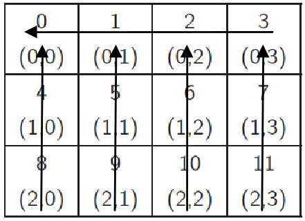

# Introduction to Parallel Programming - Project #3

This is the third and final project for the Introduction to Parallel Programming class of the Information and Computers Engineering Dept. curriculum at the University of West Attica.

This class is about, well, parallel programming using MPI.

The project's tasks are as follows:

- [ ] Create a Cartesian topology of `p` processors and with dimmensions `MxN`, where `M` and `N` are provided by the user.

- [ ] Get `n` numbers from the user where `n` is an integer multiple of `p`.

- [ ] Share the numbers with the processes in the communicator using Collective Communication methods.

Calculate the sum of the numbers (using the methods `MPI_Send` and `MPI_Recv`) with the following process:

1. - [ ] First, calculate the sum of the numbers on each column of the topology by accumulating them to the top process of each column.

2. - [ ] Then, calculate the sum of the partial sums on each one of the top processes by accumulating them to the top-left process of the topology.

- [ ] Lastly, process 0 should print the total sum to the screen.

  

